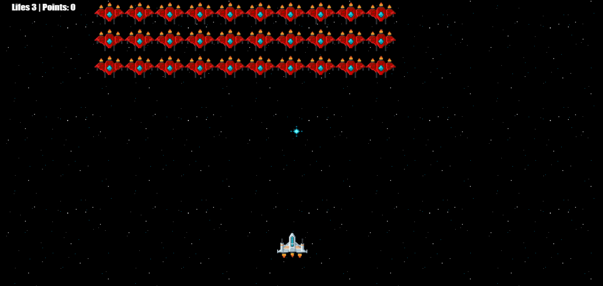

## Galaxy Games Canvas

Um exemplo de jogo inspirado em um classico games de galaxia feito em canvas.

Esse jogo é executado utilizando a Canvas API. Toda a logica do jogo é desenvolvido em TypeScript sem auxilio de game engines.

O sistema de colisão de objetos (balas e intidades) funciona com uma checagem se a posição da bala `{x: ..., y: ...}` mais a posição da bala somada com o seu tamanho `x + w, y + h` entraram na area do objeto alvo seguindo as mesmas propiedades.

O frametime do game funciona com `requestAnimationFrame` o que alem de fornecer uma atualização de renderização de acordo com a atualização da tela, ainda me forneceu o tempo `delta` para fazer calculos de velocidade e garantir consistencia da velocidade mesmo em monitores com taxa de atualização diferentes.

## Testar

Clone o repositorio e instale as dependencias com `npm i`, após isso execute o game com `npm run dev`.